# Hydra's Performance Contribution

Assignee: [Dennis Trautwein](https://github.com/dennis-tra)

Status: Completed

# Tale of Contents

- [Hydra's Performance Contribution](#hydras-performance-contribution)
- [Tale of Contents](#tale-of-contents)
- [Summary of Results](#summary-of-results)
- [Introduction](#introduction)
  - [Keyspace Coverage](#keyspace-coverage)
- [DHT Content](#dht-content)
  - [Churn](#churn)
  - [Provider Distribution](#provider-distribution)
  - [Geographic Locality](#geographic-locality)
  - [PeerID Locality](#peerid-locality)
- [DHT Performance](#dht-performance)
  - [Database Shut-Down Monitoring](#database-shut-down-monitoring)
    - [Dataset](#dataset)
- [Conclusions](#conclusions)


# Summary of Results

- The Hydra Boosters operated by PL cover almost the entire hash space (>97%)
- Majority of CIDs have only a single provider (~80%)
- Majority of content resides in the US (~55%)
- Only ten peers provide over 50% of all CIDs advertised to the DHT
- Controlled performance measurements allowed us to make an informed decision about unplugging the common database
  - Predicted performance hit for the time to first provider record ~14.8% (p50), ~14.7% (p90), and ~10.4% (p95)
  - Actual performance hit for the time to first provider record ~27.8% (p50), ~16.5% (p90), and ~12.5% (p95)
  - Reason for discrapancies: the nodes we used for our predictions operate smarter as they ignore nodes (Hydras) that don't respond with provider records anyways.

# Introduction

[Hydra Boosters](https://github.com/libp2p/hydra-booster) are a special type of DHT server node designed to accelerate content routing performance in the IPFS network. They are intended as an interim solution while exploring other DHT scalability techniques. Hydra nodes operate at the same level as any other node in the network (i.e. they don’t benefit from any privileged status in comparison to the other nodes in the network), making it a complement to the regular content routing operation on the IPFS main network.

Hydra Booster nodes strive to enhance the network in five different ways:

1. Reduce the number of hops to be performed by any other node’s `FIND_NODES` query
2. Reduce the number of hops to be performed by any other node's `GET_PROVIDERS` query (result of a)) and additionally, keep a replica (passively and proactively) of all existing fresh (i.e. not expired) records alive in the network, so that these don’t disappear due to network churn.
3. Accelerate the speed in which one-to-many `ADD_PROVIDER` queries are executed in the network. This is done both by reducing the number of hops that are needed to find the provider record but also by placing sybils in right locations to harvest and store the records rapidly.
4. Provides stability to the DHT service by injecting beefy nodes that take active participation in storing record segments from the whole unidimensional content addressing space.
5. Bridge DHT `GET_PROVIDERS` queries to indexer nodes - making large amounts of data available via the DHT that were otherwise not.

**The goal is that every peer in the DHT has at least one Hydra head in their immediate XOR proximity of 20 peers.**

In the following discussion we distinguish between Hydras, which are the VMs/containers running the Hydra functionality, and their heads. Each Hydra can have many heads where each head has their own unique PeerID and everything that comes along with it (e.g., routing table, peer store, etc.). Protocol Labs has had 135 Hydras deployed on ECS in `us-east-1`. Each Hydra had between 10 and 15 heads leading to a total of 2,015 Hydra heads. One of the Hydras is a “master” Hydra that [coordinates the PeerID generation](https://github.com/libp2p/hydra-booster/blob/8be14bf61bff477319273e5757da95c382c01a73/idgen/idgen.go#L38). 

If that condition holds true that every peer in the DHT has at least one Hydra head in their immediate XOR proximity of 20 peers, all provider records that are being stored in the DHT end up in at least one Hydra head. This provider record is then stored in a common database that **every** head has access to. If a future request hits a completely different head it will query that same database and be able to reply with the record immediately. This has been expected to drastically shorten the DHT walk.

## Keyspace Coverage

The first thing to verify is if the above assumption holds true. Do the Hydra heads that Protocol Labs operates cover the entire DHT keyspace?

The following graph illustrates that the Hydra heads follow a uniform distribution.

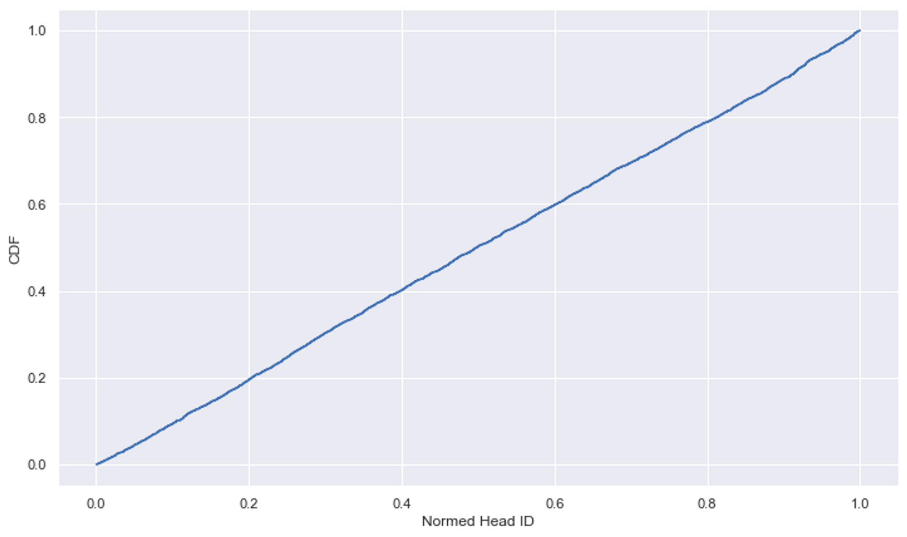

> This graph shows the CDF of normalized Hydra head PeerIDs to the range `[0,1)`. If this wasn’t a straight line the distribution wouldn’t be uniform.

However, the linear relationship above is at best a necessary condition and not sufficient. To determine the fraction of the network that the Hydra heads cover we constructed a [binary trie](https://github.com/guillaumemichel/py-binary-trie) of all peers in the DHT network. We used a [Nebula](https://github.com/dennis-tra/nebula) DHT snapshot to get a list of all peers. Then we calculated the 20 closest neighbors to each peer and checked if one of these neighbors is indeed a Hydra head. We found the following numbers:

- Total number of peers in the network: `16,208`
- Peers with at least one Hydra head in the proximity of 20 peers: `15,732`

This makes a keyspace coverage of `97.1%` and proves that the Hydras indeed cover *almost* the entire DHT. This result underpins all the following conclusions and should be kept in mind.

# DHT Content

In this section, we’ll take a look at the content that is stored in the DHT. Since we’ve proven that the Hydras operated by Protocol Labs cover most of the key space for all our intents and purposes, we investigate the provider records that are stored in the common database. First we’ll take a look at the total number of provider records from November 2022:

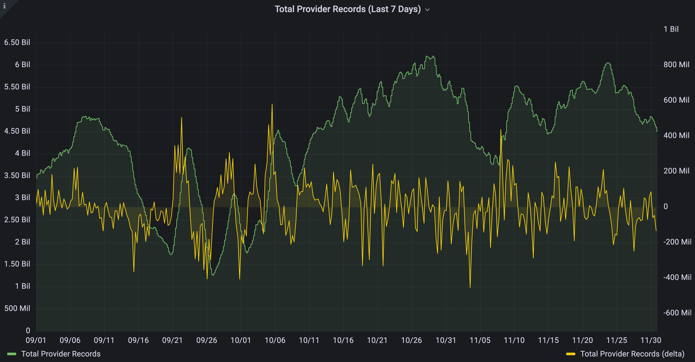

The green line in the graph shows the unique provider records in the common database (in PL’s case a DynamoDB). This means these are unique CID-PeerID combinations. The yellow line in the graph shows the delta of CIDs between subsequent 6h time windows. This could give information about the CID churn rate which would be relevant for DHT reproviding times. However, this data is not enough to calculate a CID churn rate.

## Churn

To calculate the CID churn rate we took daily database dumps of all stored provider records and compared the overlap of subsequent dumps. The following graph shows the results:

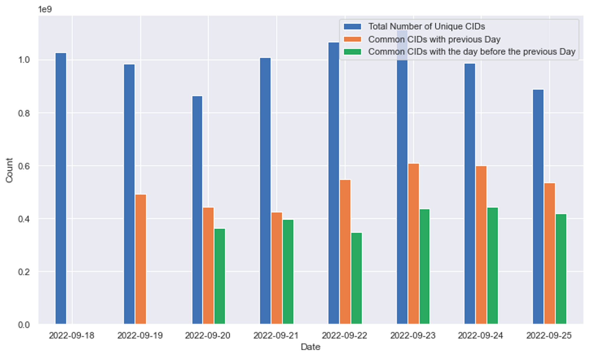

> Data and query can be found [here](https://www.notion.so/2022-09-20-Hydras-Analysis-5db53b6af3e04a46aaf7a776e65ae97d)

The above graph shows the total number of unique CIDs in the common Hydra database (blue bars). The orange bars show the intersection with the previous day and the green bar shows the intersection with the day before that (i.e., two days in the past). There is on average 50% churn rate of CIDs within 24h. Assuming that each CID corresponds to a 256kB chunk (default chunk size in kubo) we see that ~120TB of data churn but also that an equal volume join each day. However, as can be seen from the first graph. The total number of provider records (and indirectly the total number of unique CIDs) varies quite a bit over time.

The number of total unique CIDs in this graph is less than in the previous one because the former shows unique CID/PeerID combinations (each of them constitutes a Provider Record) while this graph only shows the unique CIDs.

The associated churn graph looks as follows.


Note that this graph does not account for reappearing CIDs and that we stopped after six days. CIDs could stay longer in the network.

## Provider Distribution

In this section, we’ll take a look at the locality of content - meaning, at which PeerIDs does content reside. For that, we first determine how many distinct providers CIDs have:

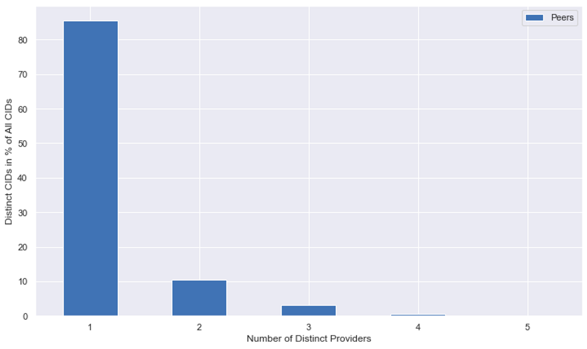

The above graph shows the number of distinct provider PeerIDs that are associated with a single CID as a fraction of the total number of CIDs. One can see that ~85% of all CIDs in the DHT network only have a single provider, ~10% two, and so on. Interestingly, the distribution has a long tail with [a few CIDs that have *tons* of providers (see "CID Distribution")](https://pl-strflt.notion.site/2022-09-20-Hydras-Analysis-5db53b6af3e04a46aaf7a776e65ae97d). There are eight CIDs with over 30k distinct providers. Sampling these CIDs revealed that they belong to the auto-generated content when you run `ipfs init`. Here’s an excerpt:

```
QmRGXm9gpLBkUsz7SBDNgeR45vMK3w99R5Ep6JGAYjuwqy
QmU5k7ter3RdjZXu3sHghsga1UQtrztnQxmTL22nPnsu3g
QmPZhyTu8D7NqR5NvgkgNYsSYD4CNjnyuFejB4i23itJvA
QmPJWgZumK11DquASVuKkG55XXEPxWZ62a1UVBoCHxgEnM
QmYCvbfNbCwFR45HiNP45rwJgvatpiW38D961L5qAhUM5Y
QmeeAzS2zaJL1WTqAnfpJKJdLcxWHgzEHEBgdnuMJLyMFk
QmUpYtJoyby5jYg9oez8qLpMxqae4pe6rHxsmtWLH2APTZ
QmWRREU4Zt6Y7jnimD2cLrsTmCEXAAnowNKfBM8PLzo4PV
QmQPeNsJPyVWPFDVHb77w8G42Fvo15z4bG2X8D2GhfbSXc
QmUqKhVJCtjj7KXqf4AKNjQxW2krN34vFz6uMV4vPDMSoe
....
```

If we look at this relationship the other way around we can check which provider PeerID stores what percentage of all CIDs in the network. We arrive at the following distribution:

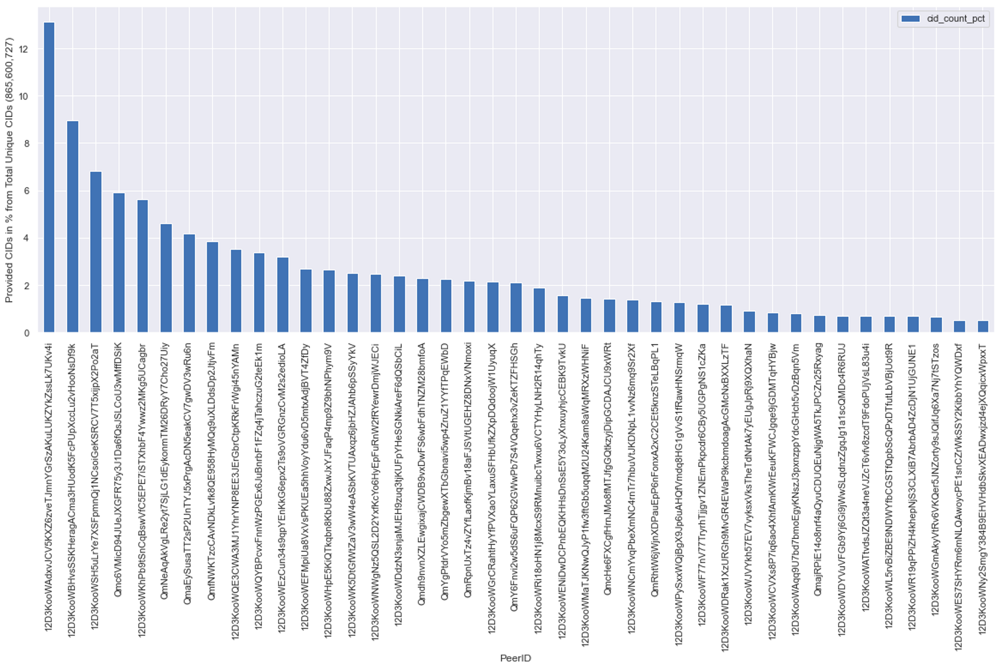

> **Note:** The percentages can add up to over 100% because single CIDs can be provided by multiple peers. Imagine there’s only one CID in the whole network and two peers providing it. This means both provide 100% of all CIDs which would add up to 200% in total.
> 

The graph shows that over 50% of all CIDs that are advertised to the DHT are provided by just 10 peers. The exact numbers can be found [here](https://www.notion.so/45c6e62247e64468a4a01a293e494eb2).

| PeerID | Countries | CIDs | % of Total Unique CIDs |
| :--- | :--- | ---: | ---: |
| 12D3KooWAdxvJCV5KXZ6zveTJmnYGrSzAKuLUKZYkZssLk7UKv4i | [NL, US] | 113712720 | 13.1 |
| 12D3KooWBHvsSSKHeragACma3HUodK5FcPUpXccLu2vHooNsDf9k | [US] | 77453473 | 8.9 |
| 12D3KooWSH5uLrYe7XSFpmnQj1NCsoiGeKSRCV7T5xijpX2Po2aT | [US] | 58918351 | 6.8 |
| Qmc6VMicD94JUeJXGFR75y3J1Da6fQsJSLCoU3wMffDSiK | [US] | 51064158 | 5.9 |
| 12D3KooWKhPb9tSnCqBswVfC5EPE7iSTXhbF4Ywwz2MKg5UCagbr | [US] | 48695209 | 5.6 |
| QmNeAqAkVgLRe2yt7SjLG1dEykonmTM26DRyY7Cho27Uiy | [US] | 40020725 | 4.6 |
| QmaEySusaTT2sP2UnTYJ5xPrgAcDN5eakCV7gwDV3wRu6n | [US] | 36257502 | 4.2 |
| QmfNWKTzcCAvNDkLvfk8QE958HyMQq9uXLDdsDp2JtjvFm | [US] | 33193462 | 3.8 |
| 12D3KooWQE3CWA3MJ1YhrYNP8EE3JErGbrCtpKRkFrWgi45nYAMn | [NL] | 30393967 | 3.5 |
| 12D3KooWQYBPcvxFnnWzPGEx6JuBnrbF1FZq4jTahczuG2teEk1m | [NL] | 29295357 | 3.4 |

Some top-providing peers can be traced back and associated with the [web3.storage](http://web3.storage) service while others are unknown to us. Known content providers can be found [here](https://docs.ipfs.tech/how-to/peering-with-content-providers/#content-provider-list).

## Geographic Locality

Since Hydras don’t only have an *almost* complete view of all provider records in the network but also a comprehensive list of peer records we can associate CIDs to IP addresses and therefore to geographic locations. The link is as follows

```
CID         ->       PeerID  ->  MultiAddresses -> IP-Addresses -> Geo Location
 |                     |                 |              |              |
 |-- Provider Record --|-- Peer Record --|--  Manual  --|-- GeoLite2 --|
```

By following these links we arrive at the following CID → Country association distribution:

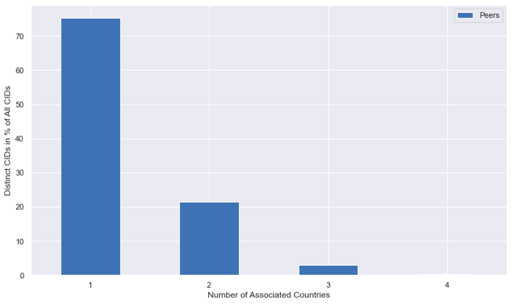

The above graph shows that ~75% of all CIDs in the Hydra database dump could be associated to a single country, ~21% to two, ~3% to three, and so on. Multiple countries for a single CID can happen if that CID is provided from multiple locations.

If we only consider the ~75% that could be mapped to a single country we arrive at the following country distribution:

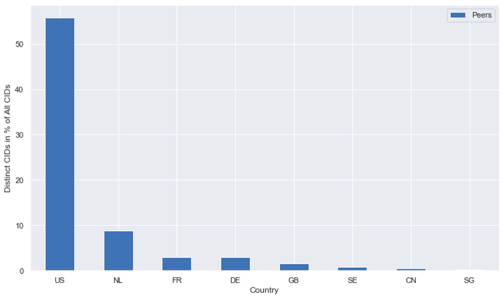

This graph shows that ~55% of all CIDs that were unambiguously mapped to a single country are provided from the US, followed by ~9% from the Netherlands, and so on. However, if we also include the multi-country mappings, the distribution looks as follows:

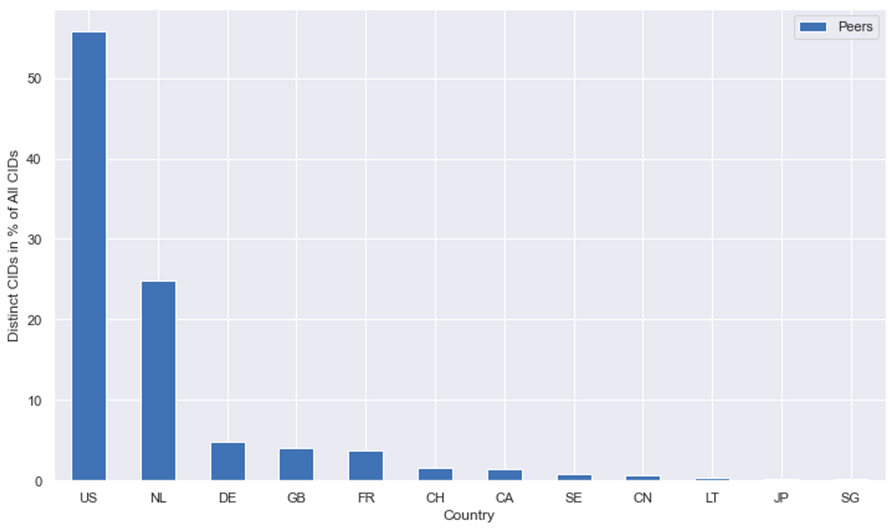

In this graph, the Netherlands, Germany and Great Britain overtake France in the first few positions. This means that these countries occupy a large fraction of the second bar in the first graph of this subsection (i.e., content whose CID is found in two countries). This means that these countries are often co-hosting content next to providers in other countries.

## PeerID Locality

As a by-product of this study we were also able to determine the country distribution of PeerIDs. In total we found ~56k PeerIDs in the Hydras’ peer stores of which 96% could be associated with a single country. Out of those the country distribution looks as follows:


The graph shows that the majority of observed peers come from the US (~45%), followed by Korea with ~10%, and so on. This deviates significantly from [our measurement study a year ago](https://research.protocol.ai/publications/design-and-evaluation-of-ipfs-a-storage-layer-for-the-decentralized-web/trautwein2022.pdf) where China was more prominently represented. On the other hand, back then we were only measuring DHT server peers while Hydras likely also store DHT client peers when they connect to them. The data also contains the ~2k Hydra Heads which correspond to ~3.6% from the US bar in the graph.

# DHT Performance

In this section, we investigate the impact of Hydras on the DHT content routing performance. For that, we have re-run the DHT lookup experiment [from a year ago](https://research.protocol.ai/publications/design-and-evaluation-of-ipfs-a-storage-layer-for-the-decentralized-web/trautwein2022.pdf) with a few changes:

1. We have updated the `go-ipfs`/ `kubo` version to `0.16.0` 
2. Added a PeerID filter to prevent certain PeerIDs from being queried
3. Used stronger VMs because correctly configuring the [resource manager](https://github.com/libp2p/go-libp2p/tree/master/p2p/host/resource-manager) was a challenge

The AWS regions in which we had deployed the nodes stayed the same. Namely: `eu_central_1`, `us_west_1`, `me_south_1`, `ap_southeast_1`, `sa_east_1`, `af_south_1`.

To assess the impact of Hydras on the DHT performance we have run two `ipfs-lookup-measurements` in parallel. One measurement filtered all Hydra heads so that they weren’t even queried for data and the other measurement didn’t filter anything at all, which corresponds to normal Hydra-powered network operation. These are the results:


This graph clearly shows that there is a performance hit when we ignore the Hydras. Specifically, 90% of the DHT retrievals yielded a provider record within the first 1.37s if we considered the responses from Hydras and 1.52s if we ignored them.

The numbers differ significantly from region to region:


This graph shows the data from the previous graph split by different regions. The regions depict where the Provider Record was requested from (not where it was served from). Interestingly the data for `me_south_1` shows increased performance without Hydras. We do not have a clear explanation of this result at this point.

Also the DHT walk path length has increased. Exemplarily, the `us_west_1` DHT walk path length has the following distribution:

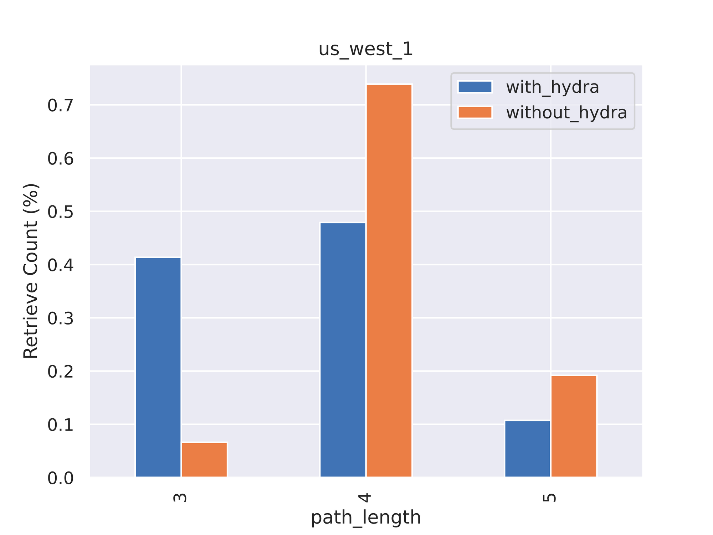

This graph shows how many DHT hops a request needs to make when we take into account vs ignore Hydra responses.  E.g., if we utilize Hydra responses, ~40% of DHT queries resolve within 3 DHT hops and ~48% within 4 DHT hops. If we ignore hydra responses, only ~8% of DHT queries resolve within 3 DHT hops ~73% within 4 DHT hops. In both cases the majority of requests need 4 DHT hops, but ignoring Hydras yields a higher percentage of 4-hop DHT walks. This graph basically summarises the contribution of Hydras in the IPFS network and explains the slight performance boost of about 10% (see first plot in this subsection) when using Hydras.

## Database Shut-Down Monitoring

Because the operation of >2k Hydra heads incurs significant costs, we were searching for ways to reduce the monthly expenses. We used the above data to justify unplugging the common database from the Hydra boosters as a first step. This allowed us to be able to “just re-attach” the database, in the case of problems, while already saving ~50% of the expenses and not mess with the DHT topology. Hydra heads would stay in the network as ordinary DHT server peers but now behave differently:

- `ADD_PROVIDER` queries would be ignored - since hydras make about ~10-15% of the network, this effectively means we are artificially decreasing the `k`-replication to 19. Our previous study on the [Liveness of Provider Records in the IPFS network](https://github.com/protocol/network-measurements/blob/master/results/rfm17-provider-record-liveness.md) showed that this does not pose a problem.
- `GET_PROVIDER` queries would only contain provider records if the CID was found in one of the network indexers. Otherwise they will always be empty and only contain closer peers because the common database is not there anymore. As said, the bridging functionality to Indexer nodes stayed intact throughout the current study.

We have deployed the change on `2022-12-01 17:30 UTC` . The following graph shows the impact on the retrieval performance in the week following the deployment:

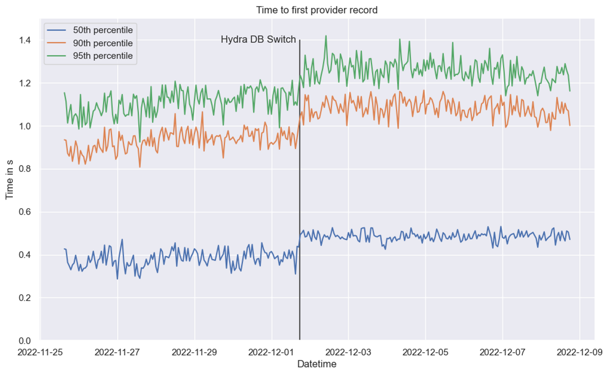

The above graph shows the 50th, 90th and 95th percentile of the time until a DHT query finds the first provider record batched by hour. One can clearly see that right after we have unplugged the database the latency increased in all percentiles. Interestingly, the variability seems to have decreased - especially for the 50th percentile.

The performance hit across all regions from before and after the DB dial down is shown in the next graph:

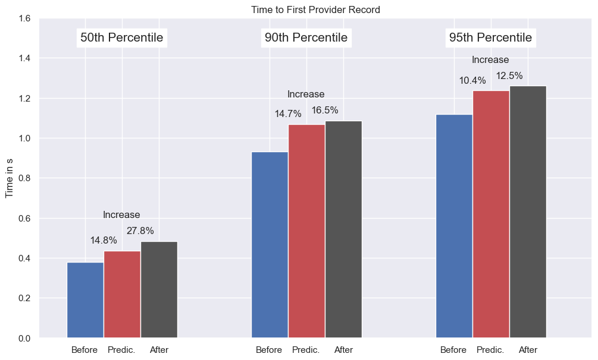

This graph shows that the predicted performance hit underestimated the observed one. While we predicted a latency increase for the 50th percentile (left-most red bar), we observe a slightly higher one (left-most black bar). The "Increase" values are all relative to the "Before" bars. While we were running the above experiment, we were also running a fleet of nodes in the same geographic locations that ignored the Hydras - equal to the first measurement. The following graph shows both results:


One can see that before we dialed down the Hydra database the performance of the nodes that ignored the Hydras was worse than the ones that were talking with Hydras. However, after the dial down the ones that were completely ignoring Hydras performed better.

The nodes that ignore Hydras effectively don’t contact peers that won’t reply with relevant answers anyways and operate smarter than the nodes that still ask Hydras for provider records. This explains why they perform better. If this hypothesis is true it could indicate that the performance gain from Hydras stems from the accelerated resolution of provider record as opposed to the accelerated peer routing (to find closer peers). After the dial down, Hydras still respond with closer peers and that’s the only thing that the “ignore hydra” nodes are missing out on. Still the “ignore Hydra” nodes perform better.

### Dataset

We uploaded all node logs to [web3.storage](http://web3.storage). The following table lists all log files, their CID, and region in which the logs were gathered. To analyse these logs we were using commit `6cda10c` from `https://github.com/dennis-tra/ipfs-lookup-measurement`. Put all files inside the folder `data/2022-12-08_hydra_dial_down`

| Log File                            | Region         | CID                                                         |
| ----------------------------------- | -------------- | ----------------------------------------------------------- |
| nodes-list-fleet-1-node-0.log       | me_south_1     | bafybeibasskgmpve4lrmaooza54bqnb4wwrl7rrh7pultbrevd4yfw7va4 |
| nodes-list-fleet-1-node-1.log       | ap_southeast_2 | bafybeiaox6urhofcizetbeq7j4o7aypajchygltzqx7ke6hbqj7eepohxq |
| nodes-list-fleet-1-node-2.log       | af_south_1     | bafybeigw2hus2b2dq27q25hqfuivivzkqa54f3tszteonmluufirjo4emi |
| nodes-list-fleet-1-node-3.log       | us_west_1      | bafybeibllhhijpo2s6qscfl5atshyj5gl24jty3ntt3d2ciqoi2kxup2nq |
| nodes-list-fleet-1-node-4.log       | eu_central_1   | bafybeiahw232qwb3idblp4ccbqr4cvk6fifudrab3lymlh4jif7z7e7zz4 |
| nodes-list-fleet-1-node-5.log       | sa_east_1      | bafybeidssh4fpef6hbic2tgxbzuyx775wnbh355b7qcqhh2tw6meusoytu |
| nodes-list-fleet-1-node-6.log       | hetzner_eu_nbg | bafybeieeavvxu7p42ehm6etgw6vhni3uugm3jtagub7ghdroxcdarsqfie |
|                                     |                |                                                             |
| nodes-list-fleet-2-node-0.log       | me_south_1     | bafybeifqbaevk53seyxmsq4whdd44iyqxvja547tmkyjyvwldr3zgqvmpq |
| nodes-list-fleet-2-node-1.log       | ap_southeast_2 | bafybeidgmuxgws7ylseocdrorpqihodv2fmwirfy3b2qj65cgc5pyszuce |
| nodes-list-fleet-2-node-2.log       | af_south_1     | bafybeihbkgxl5tpcfpxhfgr2hoevlusr62ynhp3h7urdz7uwrpkcvb7j24 |
| nodes-list-fleet-2-node-3.log       | us_west_1      | bafybeif7az3bqqyjohxcqeo7h3ygj3rvu5dknpbubh5wuav22h7mo4iete |
| nodes-list-fleet-2-node-4.log       | eu_central_1   | bafybeigwetwddf6wococblfao3zewt37umxbuqqmdtt2mzw7vlevwwvpou |
| nodes-list-fleet-2-node-5.log       | sa_east_1      | bafybeigio6e34u65e34logd3rulolg46powrh6plzdnsjnytxaskrzcaty |
| nodes-list-fleet-2-node-6.log       | hetzner_us_ash | bafybeih6kxf23f6nax4dh2m3taawe4z6hbqnfj34niqbclsidku75pudmu |
|                                     |                |                                                             |
| nodes-list-ignore-hydras-node-0.log | me_south_1     | bafybeiadsxbwfrsqxseofgkq4w3hxmlbdxgqkihplxm5r5x2bw3onjx3gy |
| nodes-list-ignore-hydras-node-1.log | ap_southeast_2 | bafybeihpjoipgokckhyadsqpn5hy3b4jo7de2lbndgjisah3bx3bum6ckq |
| nodes-list-ignore-hydras-node-2.log | af_south_1     | bafybeieb4wj4qzuyducqvsthu66n5rfzbyqgtezmibbtlbkcudm2kdrrxm |
| nodes-list-ignore-hydras-node-3.log | us_west_1      | bafybeielbcs4circmciu4p46dqgf5wakb5arxex4cmikmukxit3titbndq |
| nodes-list-ignore-hydras-node-4.log | eu_central_1   | bafybeiabdajlpczd75uuwgewnhvrygsmdqvsuzicrb3u2acppny577bvwy |
| nodes-list-ignore-hydras-node-5.log | sa_east_1      | bafybeid5g4t4z6mnzflssqabwl4vr4dp3fes2ge4khoti6ralem6ygycne |
| nodes-list-ignore-hydras-node-6.log | hetzner_eu_nbg | bafybeibegjgg7ztxceaut3kb7eytnqeaco6wlqwntnlqy7ns3lmtr6f3na |
| nodes-list-ignore-hydras-node-7.log | hetzner_us_ash | bafybeidf5ues5gldc6nidrsgqxfcd3z54cq4ypj4vnfag775r4q6rgy6by |

<!-- ## Ignoring a Fraction of Hydra Nodes


> **Note**
>
> We were running the following experiment with VMs that were not powerful enough and therefore threw a significant amount of resource manager `limit exceeded` errors. Thus, it’s hard to conclude the root cause of performance degradations - is it because we ignored hydras or because we have run into the `limit exceeded` errors?

Prior to the dial down of the common Hydra database we have run an experiment where we only ignored a subset of Hydra nodes. To ignore x% of Hydra nodes it is not sufficient to just take a random sample of all Hydra head PeerIDs because the ID generation is more sophisticated than just random. If a new Hydra head wants a new PeerID, the “master” Hydra Node generates two PeerIDs and selects the one that yields a lower depth in the XOR trie of the complete set of already existing Hydra head peer IDs. See [this code snippet](https://github.com/libp2p/hydra-booster/blob/8be14bf61bff477319273e5757da95c382c01a73/idgen/idgen.go#L87).

Therefore, if we wanted to ignore a fraction of Hydra nodes we would incur an error if we just took a random sample of PeerIDs to ignore. A better approach is to construct a binary trie from the set of Hydra head PeerIDs and removed the deepest nodes until we have reached the desired fraction of Hydra heads. However, PeerIDs with the same depth in the trie can be removed at random. This functionality was added to the [py-binary-trie package](https://github.com/guillaumemichel/py-binary-trie).

The following graph shows the result of our experiment of ignoring 0%, 25%, 50%, 75% and 100% of all Hydra head PeerIDs.

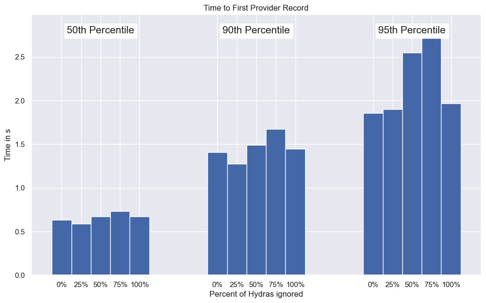

There are a couple of noteworthy results that we cannot entirely explain. For one, it is unexpected that latency improves when we ignore 25% of Hydras heads as opposed to 0%. This happens for the 50th and 90th percentile. Similarly, latency improves when increasing the percentage of Hydra heads ignored from 75% to 100%. On the other hand, we see an increase in latency with an increase of ignored Hydra heads for the 25%, 50%, and 75% cases across all percentiles.

The following graph shows the same data split by region and different parts of the retrieval process.

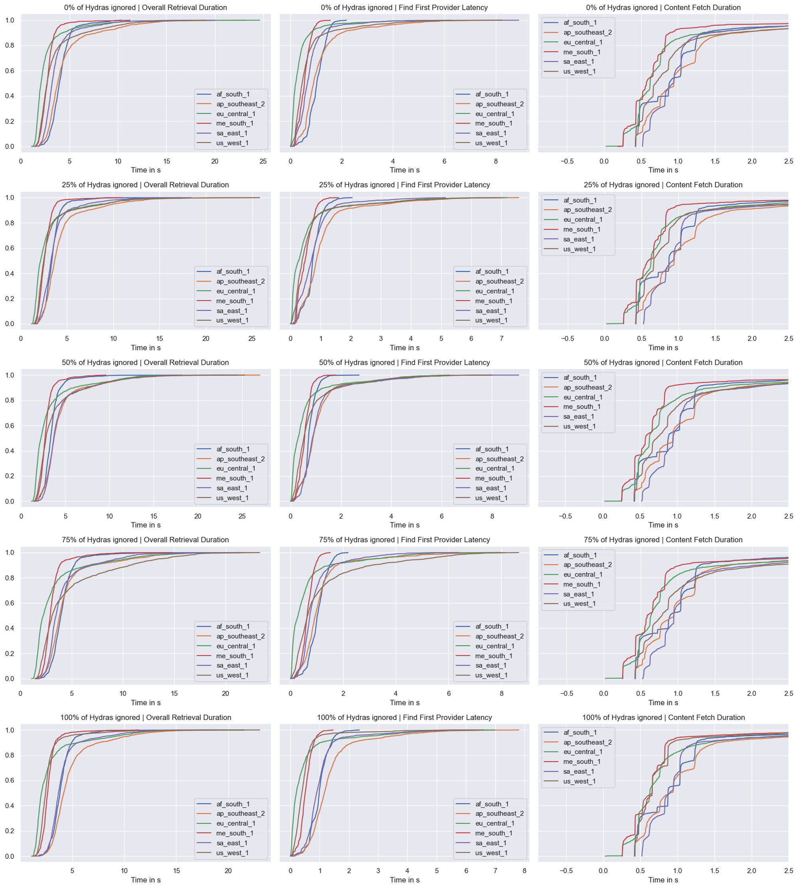

The long tails of the CDFs above are indicative for `limit exceeded` errors. This should be kept in mind when interpreting the data of the above two figures.

### Dataset

This dataset was also uploaded to [web3.storage](http://web3.storage). The region for nodes 0 - 5 are the same as in the table above. We used commit `02e84e8` from `[https://github.com/dennis-tra/ipfs-lookup-measurement.git](https://github.com/dennis-tra/ipfs-lookup-measurement.git)` to analyze the log messages.


> **Warning**
>
> **The 25pct log files actually ignored 75% of Hydras and vice-versa.**


```
nodes-list-wo-0pct-node-0.log,bafybeibghp65jzppg67ed4pkrh6hwzu7sxat5ibjk2zafif4dfe27alsqy
nodes-list-wo-0pct-node-1.log,bafybeifl5kvsopvsnzcd5smmnisasrua6e5q4zeosxxumpyc2mkiuewk5y
nodes-list-wo-0pct-node-2.log,bafybeiaaqtjgysvjoc7vmdjpxyvcz5ihmcay4zcbiz6hm54scs5rpvfi6q
nodes-list-wo-0pct-node-3.log,bafybeiduyycfmgf7yeiaardn6yatotw7jtqrfdchzw2mlxnfxmhwq4dfy4
nodes-list-wo-0pct-node-4.log,bafybeibfx4dgoyyvtagpcdmfwg4x3onl4ir7q2zccpxmpklp3ruqkqilvq
nodes-list-wo-0pct-node-5.log,bafybeih5npkzv4gn6rq2yy6q6s4p52sggouce5slwy5whk2no4crkywhpq
nodes-list-wo-25pct-node-0.log,bafybeiegdhyr7ws3g42ruh3ydm72xsvxso254i7hwfvvosof3uiebkqhfm
nodes-list-wo-25pct-node-1.log,bafybeidagng3hizmd3wb5trj47fnahbmbfkt2npy2yxfjmedtom7nxgocu
nodes-list-wo-25pct-node-2.log,bafybeiagraoaiv45cj32nzucs7fjzbsgwkmtw7shjpdrphoqsc5f6wff5m
nodes-list-wo-25pct-node-3.log,bafybeiciqszndmpmup54gefxd4ga4svodfh2fgckyzsn3ppe6mz6ynq6fi
nodes-list-wo-25pct-node-4.log,bafybeie3gmisqc46jm63xrbfpafisd6dr4tf6djhufy74r7ymaejygkw4e
nodes-list-wo-25pct-node-5.log,bafybeibdvnsqswawozvosruppkyse56bq4nv622ajfikvtuag5bm2tvf7a
nodes-list-wo-50pct-node-0.log,bafybeiehg5cjffkljtix24223lehprqatcvn4ijpzghayk5pwkxgljeuvq
nodes-list-wo-50pct-node-1.log,bafybeieycd3ruuifksgzf66tqrgkt3jd43edjxgwm6fofiawxnxzttlpjq
nodes-list-wo-50pct-node-2.log,bafybeicnrsw5iepevuh3jvh5rsufncis7ey75jb6vtfv7idklpm4jxkbsy
nodes-list-wo-50pct-node-3.log,bafybeif5u5em6xz4smbxoaie7wlav276vuytbfmy2o4khy636o3s2bsyo4
nodes-list-wo-50pct-node-4.log,bafybeiflpmhfaqqdzrjdhexvjvnwnk4eiihq4qt54lqvrsb6w3y7yioj7q
nodes-list-wo-50pct-node-5.log,bafybeihgeoxweup6zsz3hlhwg7nshlmxatpcuc3ng4bycl342xozzhju5q
nodes-list-wo-75pct-node-0.log,bafybeiey4u3melcfqh2ysjc7nryrk7qgvo2o44be6s5rm7wv5ivjacfuj4
nodes-list-wo-75pct-node-1.log,bafybeiaetgkem7aqskoa4wswosrbzf7ossialxpom2uy6dwoe3yrftslc4
nodes-list-wo-75pct-node-2.log,bafybeiduhdvsd6oikhq6ig2dzh7fkdykdnyhz3tjudfx4sbepu22jimr3a
nodes-list-wo-75pct-node-3.log,bafybeigvzlgigj2nwr4cerrop2ovzjgawfzwhyrtfacvdq47dth3ammvju
nodes-list-wo-75pct-node-4.log,bafybeibiy5rlztkminu5r6ayx4vqlr6obsogxf3toioss4mlr2u5lbbtk4
nodes-list-wo-75pct-node-5.log,bafybeia53qtbkerotwkiubrods7hvttjazm4vyddcbsv6gmhl7rcrupi5y
nodes-list-wo-100pct-node-0.log,bafybeiazi6tymdoocodvuff5xfmkxfix37pkvdtgakgvmvb52a2ihmfzxy
nodes-list-wo-100pct-node-1.log,bafybeifdsedussi4yjrbgphmvctt2h3fh354srgha7c7thecocqfa627ke
nodes-list-wo-100pct-node-2.log,bafybeidmcebgkikreosgzzywh4anfkjr3bb2pcezqojdj3rj5w2i2zmnbu
nodes-list-wo-100pct-node-3.log,bafybeieqcc2v3k2l7h2yyyyfyatybmboh4fmpjfxfgyb44cfqgw6yhyjlm
nodes-list-wo-100pct-node-4.log,bafybeibjg2ievigbcn4zr5hc4ajk4sz3ntnz33tq7gmtk5dot5etzp7g44
nodes-list-wo-100pct-node-5.log,bafybeierm5lusex4stqmtj5zx4jbwws6safenv23mjoeo4sbk5lzqmnoja
``` -->

# Conclusions

Our Hydra-Booster study uncovered insights not known before. The unique position which Hydras occupy in the network allows us to get a comprehensive view of the content and peers in the network. We found that the majority of content has only one providing peer and likely resides in the US. Further, only a few big content providers dominate the network. Over 50% of all CIDs advertised to the DHT are provided by only ten peers. We also proved that they indeed cover almost the entire hash space.

Controlled experiments estimated the performance impact of removing Hydras from the network. We predicted the performance impact to be ~14.8%, ~14.7%, and ~10.4% slower time to first provider record for the 50th, 90th, and 95th percentiles. However, we observed a ~27.8%, ~16.5%, and ~12.5% increase respectively. Our predictions were slightly too optimistic because nodes that ignore Hydras (as we used them for our estimation) effectively don’t contact peers that won’t reply with relevant answers anyways and therefore operate smarter than the nodes that still ask Hydras for provider records. Nevertheless, the measurements allowed us to make an informed decision about unplugging the common database.
