# RFM 7 | Distribution of DHT lookup times and Breakdown of Content Routing Latency

* _Status:_ **completed**
* _DRI/Team:_ [`@gitaaron`](https://github.com/gitaaron)
* _Effort Needed:_
* _Prerequisite(s):_ NONE
* _Value:_ **HIGH**

## Table of Contents

- [Motivation](#motivation)
- [Methodology](#methodology)
  - [Experimental Runs](#experimental-runs)
  - [Experimental Controls](#experimental-controls)
  - [Analysis](#analysis)
  - [Problems with Results and Workarounds](#problems-with-results-and-workarounds)
- [Results](#results)
- [Conclusion](#conclusion)
- [Next Steps](#next-steps)

## Motivation

Live IPFS network performance is hard to model due to the unpredictable nature of actors in the network and the increased complexity in calculating the dynamics of an interacting system.

To get a better understanding of how the live network is performing under different circumstances, a set of probes in geographically distributed AWS regions running a forked version of Kubo (0.16.0-dev) with additional logs (for benchmarking purposes) were deployed to interrogate the live network.

The following environmental variants were introduced to help improve confidence in the measurements as well as assist in understanding where improvements might affect network performance the most and for which scenarios.

  * regional

  * file size (0.05, 0.5, 5, 50 MB)

  * number of publishers (1 or 5)

  * delays between publication and retrieval

  * agent uptime

Protocol designers and client developers might leverage this information to help understand which phases in the content retrieval process might benefit the most for certain scenarios as well as how performance is affected at different snapshots in time.

## Methodology

### Experimental Runs

Each experimental run has two different types of players as agents.

  1.  Publishers shared (via `ipfs add`) randomly generated content to the network

  2.  Retrievers performed an `ipfs cat` request to download the prior shared content

Each run also involved a seperate node acting as controller instructing the publishers and retrievers accordingly.

The following is a sequence diagram illustrating how a typical run involving one controller and three agents might proceed.

```mermaid
sequenceDiagram
    Controller->>Agent1: Publish[Data]
    Agent1->>Controller: Ok[Finished]
    Controller->>Agent2: Retrieve[CID]
    Controller->>Agent3: Retrieve[CID]
    Agent2->>Controller: Ok[Finished]
    Agent3->>Controller: Ok[Finished]

    Controller->>Agent1: Disconnect[AgentList[PeerID]]
    Controller->>Agent2: Disconnect[AgentList[PeerID]]
    Controller->>Agent3: Disconnect[AgentList[PeerID]]
```

In this case, 'Agent1' would be considered the 'main player' in the run where they are the only agent performing the `PUBLISH` action and the other agents are simply actors without any distinction acting as the other player type (`RETRIEVER`).

This distinction between 'main players' was made to support [multi provider retrievals](#multi-provider-retrievals).

### Experimental Controls

Various controls were introduced to see if any trends in regions, file size, number of publishers, publish age and agent uptime might occur.

The following describes how each of these controls were introduced.

#### Regions

Following on [prior work](https://github.com/dennis-tra/ipfs-lookup-measurement), probes were geographically distributed across different AWS regions and runs with a main player acting as both `PUBLISHER` and `RETRIEVER` were invoked in a round robin fashion.

This means that approximately the same number of runs with agents acting as `PUBLISHERS` and `RETRIEVERS` should have occured for each region.

In practice, there were diverging results probably due to agents being restarted in the middle of runs or because retrieval events were discarded in certain regions more often than others.

The regions included were:

| Region Key       | Closest Approximate City   |  Instance Size |
|------------------|----------------------------|----------------|
| `me_south_1`     | Bahrain                    | t3.small       |
| `ap_southeast_2` | Sydney                     | t2.small       |
| `af_south_1`     | Cape Town                  | t3.small       |
| `us_west_1`      | N. California / Sacramento | t2.small       |
| `eu_central_1`   | Frankfurt                  | t2.small       |
| `sa_east_1`      | Sao Paulo                  | t2.small       |

#### Multi Provider Retrievals

In prior work, runs were only performed where there was a main player acting as a `PUBLISHER` and all other agents were acting as a `RETRIEVER` for each run.

In this study, runs were also performed where a main player acted as `RETRIEVER` and all other agents acted as a `PUBLISHER`.

This enabled results to be analysed between single and multi provider retrievals.

#### File Size

Runs with a main player type of both `PUBLISHER` and `RETRIEVER` were invoked for different file sizes that differed by an order of magnitude of power 10 (0.05MB, 0.5MB, 5.0MB and 50.0MB).

#### Publish Age

To gain a diverse set of publish age times, the experimental run was split up into two different parts.

The first part involved the publisher(s) sharing content to the network.

The second part involved retrievers subsequently downloading the content from the first part.

Since only a single run should be performed at any given time, the second part was delayed by allowing other runs to occur first.

As seen in the figure below, the results used with publish age had an immediate spike followed by an uneven distribution between 2000-12000 seconds.

This is due to the requirements that only one run should be happening at any given time.  More control over the distribution of publish age is possible if delays were run in isolation although it would take longer to obtain an adequate sample size over time.

#### Agent Uptime

To acquire a diverse set of results for agent uptime, a crontab script was executed to 'restart agents' every 6 hours.

Restarting each agent involved instructing terraform to terminate each agent instance in AWS and reinstall the forked 'Kubo' and supporting 'agent' applications from scratch.

As a result of this, each fresh install of 'Kubo' can be thought of as a new (never before seen) peer in the network that acquires a new `PeerID` upon restart.

### Analysis

As in prior work, Kubo (with patches for more logging) logs were parsed for events related to benchmarking.

The following provides more details on phase calculations for [retrieval](https://github.com/gitaaron/ipfs-lookup-measurement/blob/main/analysis/retrieval-events.md) and [publication](https://github.com/gitaaron/ipfs-lookup-measurement/blob/main/analysis/publish-events.md) events.

The lifetime of phases can be overlapping.  As in prior work, durations of phases were calculated based on when the next phase was kicked off.  For example, the `GETTING_CLOSEST_PEERS` duration was calculated based on when the phase started to when the `DIALING` phase started (not when the DHT walk ended).

Each run contains a unique CID so that publish and retrieval events could be combined to generate a publish age metric (based on time from first publish finish to time of the start of retrieval).

In addition to the Kubo logs, agent logs were also parsed for getting agent health, uptime and retrieval end times.

#### First Referrers and First Providers

Each retrieval contains both a "first referrer" and a "first provider".

A "referrer" is defined as the peer responding with provider records and a "provider" is defined as the peer that is responding with the actual contents of the file that was requested.

The "first provider" would be the peer that the retriever attempts to fetch the content from first and the "first referrer" would be the first peer that responds with the address of the first provider.

#### Number of Hops to First Provider and Hop Response Time

While walking the DHT looking for content provider(s) of a given CID, there are two expected payloads that each peer (referrer) should give back to the retriever.

  1.  A list of provider records containing the addresses (or Peer IDs) of the content providers.

  2.  A list of their closer peers that are more likely to have a provider record or the content itself.

If the referrer responds with an empty list of provider records, then the retriever must contact the referrer's closest peers and so on until they find at least one provider record.  Inevitably the walk terminates when the retriever does not encounter any closer peers it has not seen before.

Each new contact with a peer is considered a 'hop' and 'number of hops to first provider' would be the number of requests to unique peers that the retriever has to make before they find the first provider.

A retriever might make a lot more 'total hops' than 'number of hops to first provider' during the retrieval process since they are simultaneously following many potential paths towards the goal.

'Number of hops to first provider' was used instead of 'total hops' since the former matches duration in the `GETTING_CLOSEST_PEERS` phase.

There could also be more than one path taken to locate the first provider as illustrated in the diagram below.

Since 'number of hops' is studied in the context of finding bottlenecks, only the shortest number of possible hops are considered.

So when each new peer is visited, the peer with the least number of hops to the new peer is considered the referrer.  This is probably a fair assumption as long as the sequence of events are parsed in order.

When each new peer is encountered, if it appears in the closer peers list as a response from another peer first, then chances are it came from that peer since the retriever would have otherwise skipped the further peer and went to the closer peer directly.

There is, however, one exception to this rule: if a new peer is listed as a closer peer from a previous hop, then it should always be counted instead of assuming the referrer was the retriever itself (since there is no way to tell if it is coming directly from the retriever due to a limitation with the current logging mechanism).  By similar logic, when each new peer is encountered, if it were already a closer peer in the retriever's routing table then the retriever should have dialled it first.

The diagram below attempts to illustrate this.  For example, when 'Peer B' is visited, the referrer responsible for the visit would be 'Peer A' instead of 'Peer C' since the retriever should have dialled 'Peer B' at roughly the same time as dialling 'Peer C'.

So in this case, the number of hops to the first provider would be three and not four.

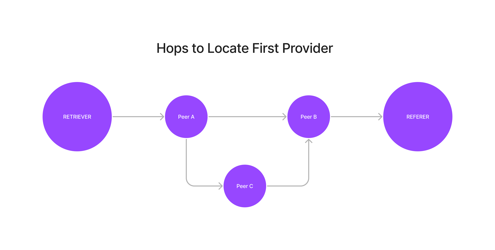

#### How Performance was Measured

The analysis used two different metrics to evaluate performance: "average duration" and "percent slow".

"Average duration" was used to determine how fast retrievals generally occured and "percent slow" was used to determine the likelihood that a problem might occur under various conditions.

In order to normalise the metrics over different file sizes, "average duration" was plotted for a specific file size and "percent slow" was calculated as the number of retrievals that took more than one standard deviation greater than the mean for each file size.

Certain graphs also filter on "fast" durations.  Since the standard deviation for certain phases could be greater than the mean, "fast" was considered to be anything under the mean.

The following tables include what would be considered "slow" for each phase and file size.

**File Size: 52429 B**

| Phase                 | Mean (sec.) | Standard Deviation (sec.) | Slow (> sec.) |
|-----------------------|-------------|---------------------------|---------------|
| TOTAL                 | 2.661       | 1.318                     | 3.979         |
| INITIATED             | 1.009       | 0.073                     | 1.082         |
| GETTING CLOSEST PEERS | 0.62        | 0.641                     | 1.261         |
| DIALING               | 0.551       | 0.479                     | 1.03          |
| FETCHING              | 0.481       | 0.625                     | 1.106         |

**File Size: 524290 B**

| Phase                 | Mean (sec.) | Standard Deviation (sec.) | Slow (> sec.) |
|-----------------------|-------------|---------------------------|---------------|
| TOTAL                 | 4.032       | 2.828                     | 6.86          |
| INITIATED             | 1.01        | 0.064                     | 1.074         |
| GETTING CLOSEST PEERS | 0.657       | 0.683                     | 1.34          |
| DIALING               | 0.65        | 0.659                     | 1.309         |
| FETCHING              | 1.714       | 2.154                     | 3.868         |

**File Size: 5242900 B**

| Phase                 | Mean (sec.) | Standard Deviation (sec.) | Slow (> sec.) |
|-----------------------|-------------|---------------------------|---------------|
| TOTAL                 | 7.107       | 4.643                     | 11.75         |
| INITIATED             | 1.003       | 0.027                     | 1.03          |
| GETTING CLOSEST PEERS | 0.577       | 0.46                      | 1.037         |
| DIALING               | 0.584       | 0.476                     | 1.06          |
| FETCHING              | 4.942       | 4.502                     | 9.444         |

**File Size: 52429000 B**

| Phase                 | Mean (sec.) | Standard Deviation (sec.) | Slow (> sec.) |
|-----------------------|-------------|---------------------------|---------------|
| TOTAL                 | 20.072      | 5.981                     | 26.053        |
| INITIATED             | 1.001       | 0.002                     | 1.003         |
| GETTING CLOSEST PEERS | 0.556       | 0.361                     | 0.917         |
| DIALING               | 0.499       | 0.312                     | 0.811         |
| FETCHING              | 18.015      | 5.985                     | 24            |

### Problems with Results and Workarounds

Unfortunately, due to the nature of running the experiment under many different environmental variants and other problems with the setup, small sample sizes and other problems affecting the utility of measurements occurred for certain scenarios.

#### File Size

While the experiment was running, it was discovered that the timeout was too low for the largest file size (50.0 MB with 20 sec. timeout) for the `CAT` request and most retrievals (average total duration of 20.072 sec.) were discarded.

The error was fixed (by increasing the timeout to 35 sec.) during the course of the experiment, however, there are two problems with the largest file size (as seen below in the CDF for this file size).

  1.  The sample size is too low.

  2.  Performance metrics are skewed by the erroneous timeout (eg/ the average duration for the largest file size was ~17-18 sec. before the correction).

For this reason, the largest file size was mostly ignored except when used to corroborate trends from the three smaller sizes.

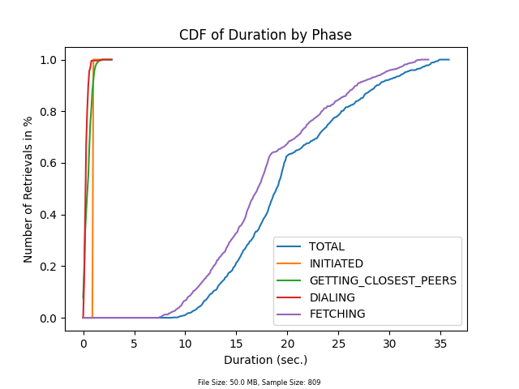

#### Many Providers

Naturally, since there is only one `RETRIEVER` for the main player `PUBLISHER` runs, there were fewer retrievals that had many providers. (25906 single vs 3676 multi)

For this reason, it's hard to draw any solid conclusions between multi provider retrievals and regions.

#### Fetch Phase Estimation

As seen in [retrieval events](https://github.com/gitaaron/ipfs-lookup-measurement/blob/main/analysis/retrieval-events.md), the fetch phase was calculated from when the retriever connected to a provider to when the retrieval (`CAT` request) finished.

Thus, the `FETCHING` phase calculation is also probably including other steps unrelated to the content being retrieved over the network via bitswap (in particular, the 'content verification' step).

Chances are these steps can be considered negligible compared to the time it takes to fetch the content over the network, however, file size duration trends can only be concluded as directional (increasing, decreasing or staying the same).

However, since the time it takes to perform the other non network related steps should generally be constant, the percent slow calculations can still be used.

Further, file sizes can still be used to see if other trends occur more dramatically for certain environmental variables (eg/ how does `FETCH` perform for larger file sizes when comparing single and multi provider retrievals)

#### Filtering Out Unexplained Failures in Resolutions

There are many reasons a retrieval may end in a failure to resolve.

A failure could have occurred because there was a bug in the client or protocol during the retrieval process, because of agent or network load, or because there was an error in the experimental setup.

For this reason, failures were ignored for all calculations in this study.

Filtering out failures could have skewed results (if, for example, the failure occurred due to a timeout that would have succeeded if waiting a little longer) and also had a fairly large impact on sample size.

Failure rates are included in this report since they could provide some insight.

## Results

The following results are based on a specific snapshot from `29-10-2022 17:34` to `09-11-2022 21:02`.

Here is the CID for a complete list of figures generated: ipfs://QmaSt9jLtp9XLDTdHMxNdb5G9kiuzJctHdvVBLWRPWHVXe

You can open the link above in an IPFS compatible browser or using a gateway (such as https://w3s.link/ipfs/QmaSt9jLtp9XLDTdHMxNdb5G9kiuzJctHdvVBLWRPWHVXe) to see each graph rendered in a single page.

1.  The `GETTING_CLOSEST_PEERS` average duration (0.619 sec.) is roughly the same as the value reported in [Design and Evaluation of IPFS: A Storage Layer for the Decentralized Web](https://ipfs.io/ipfs/bafybeidbzzyvjuzuf7yjet27sftttod5fowge3nzr3ybz5uxxldsdonozq) which reported 0.622 sec.  This is comparable to the average duration of the `DIALING` phase which was 0.579 sec.

2.  The following is a ranking of how each region performed in the `GETTING_CLOSEST_PEERS` phase based on average duration.

    a ) `eu_central_1`

    b ) `us_west_1`

    c ) `me_south_1`

    d ) `sa_east_1`

    e ) `af_south_1`

    f ) `ap_southeast_2`

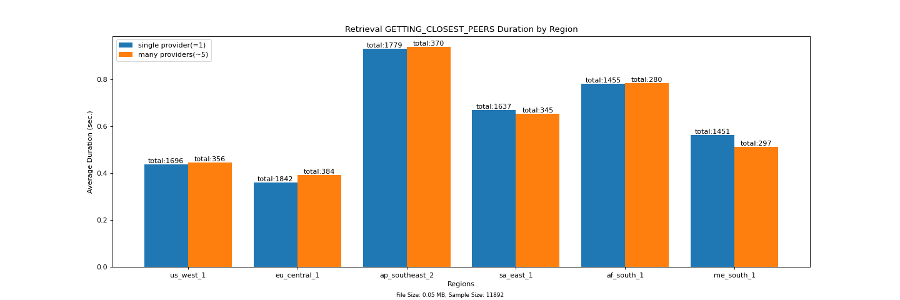

3.  The following is a ranking of how each region performed in the `GETTING_CLOSEST_PEERS` phase based on percent slow.

    a ) `me_south_1`

    b ) `us_west_1`

    c ) `eu_central_1`

    d ) `sa_east_1`

    e ) `af_south_1`

    f ) `ap_southeast_2`

4.  The following is a reverse ranking of failure rates by region (with the lowest failure rate at the top)

    a ) `us_west_1`

    b ) `eu_central_1`

    c ) `sa_east_1`

    d ) `ap_southeast_2`

    e ) `af_south_1`

    f ) `me_south_1`

5.  The average number of hops to the first provider[HTFP] over every region is 1.74.  HTFP is not a strong differentiator of performance in the `GETTING_CLOSEST_PEERS` phase for each region.

6.  Percent hydras as first referrers is also not a strong differentiator of performance in the `GETTING_CLOSEST_PEERS` phase for each region.

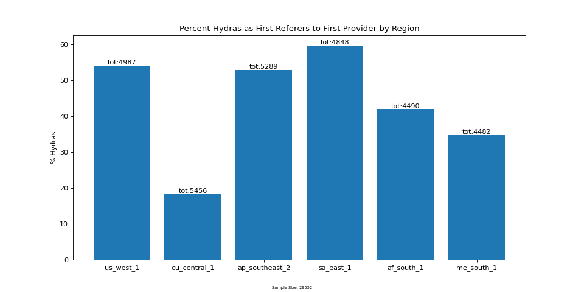

7.  Hydra boosters are more commonly involved as first referrers of provider records for fast vs slow `GETTING_CLOSEST_PEERS`, however, they are not the majority.

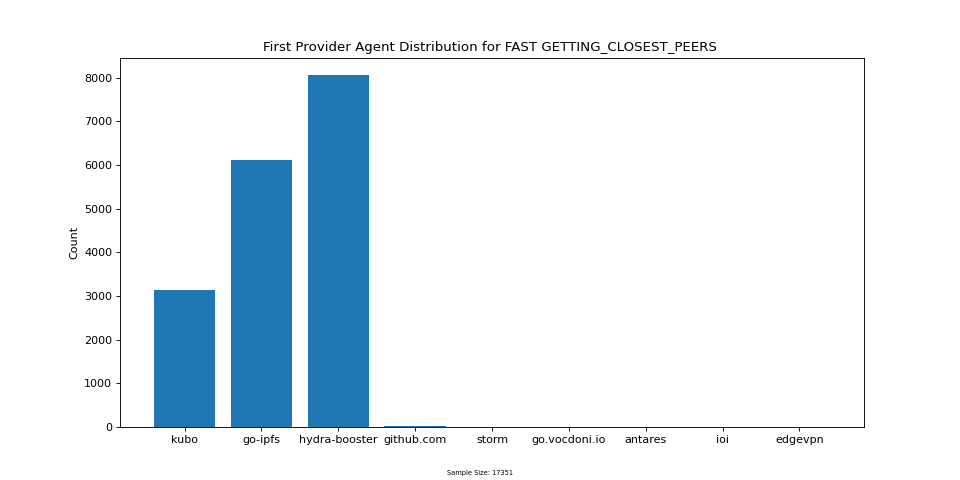

8.  Multi provider retrievals tend to perform the same as single provider retrievals during the `GETTING_CLOSEST_PEERS` phase.

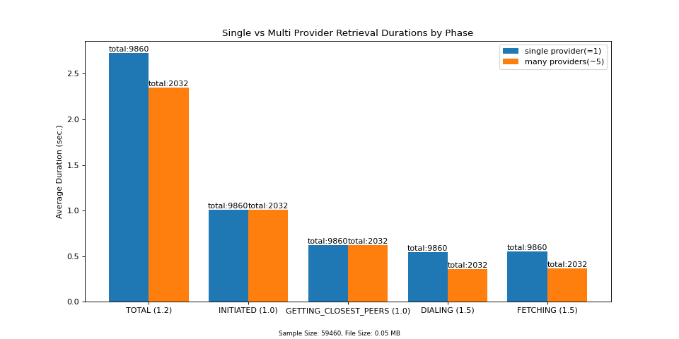

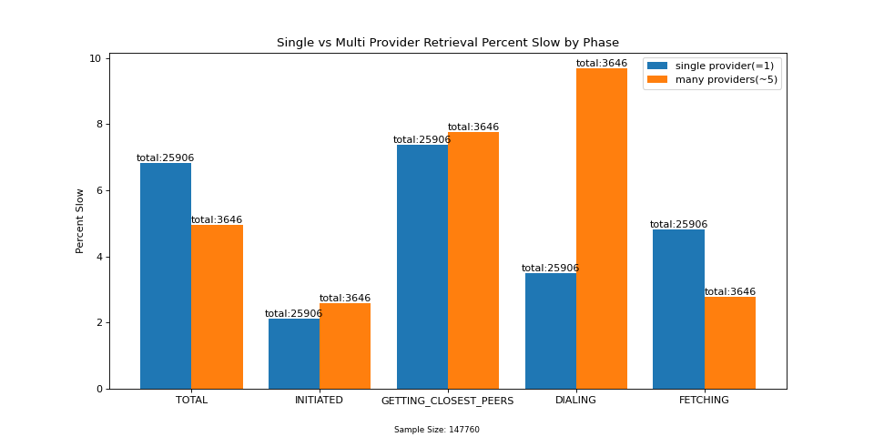

9.  Speeds do increase for multi provider `FETCH` but not as much as one would expect if the content were downloaded in parallel from equally fast connections between the retriever and each publisher.

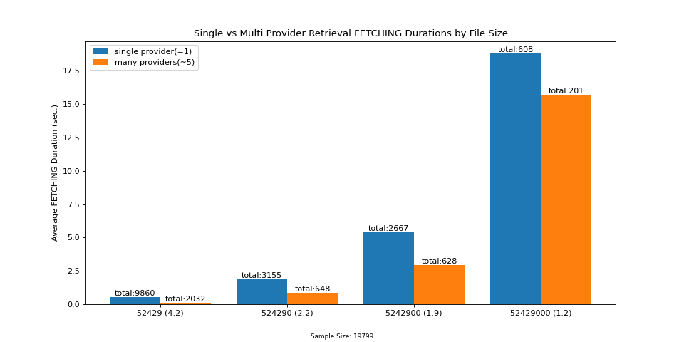

10.  File size did not effect performance in the `GETTING_CLOSEST_PEERS` phase between 0.05 and 0.5 Mb.  However, there was a noteworthy decrease in success rate between 0.5 and 5.0 MB size files.

11.  Performance seems to degrade with publish age.

12. Performance seems to degrade with agent uptime.

13. There is no strong correlation in durations between the `GETTING_CLOSEST_PEERS`, `DIALING` and `FETCHING` phases. 

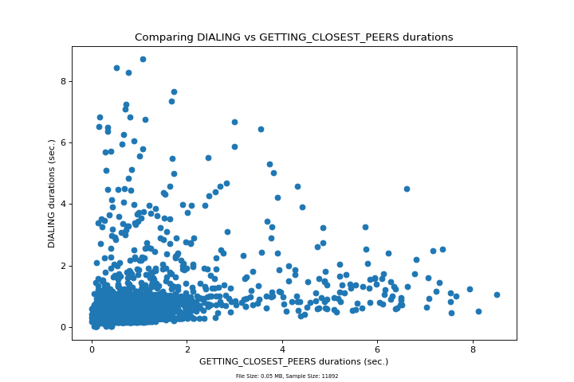

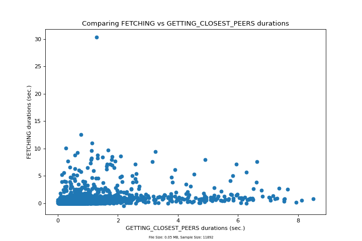

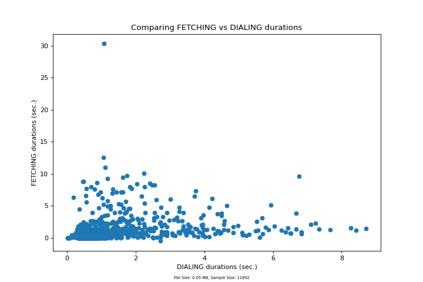

14.  Retrievals corresponding to runs with many publishers consistently did not have all five providers in the response from the first referrer.

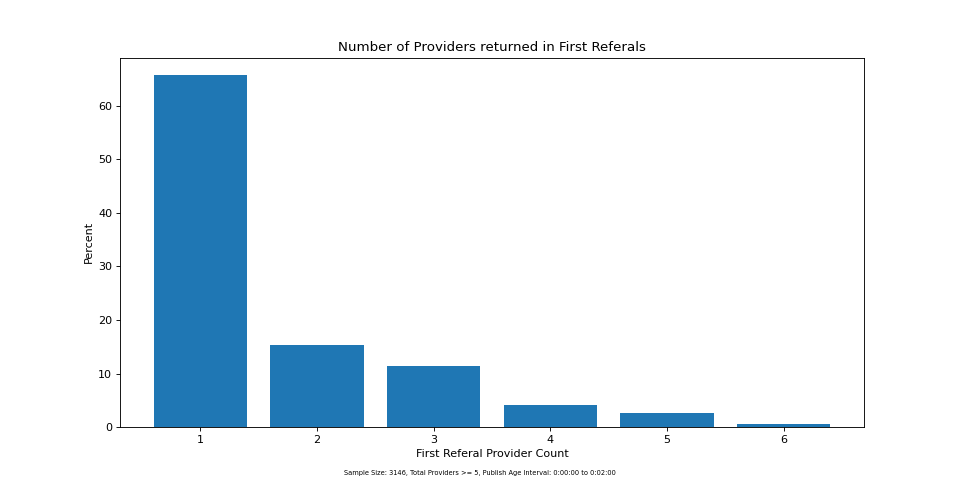

However, after fully walking the DHT, the average number of total provider peers found was 4.731 (out of 5).

The average number of closest peers that publishers were able to successfully announce that they have a CID to was 17.36 for all runs and 17.4 for multi provider runs.

The average number of unique closest peers that publishers successfully announced that they have a CID in multi provider runs was 19.67.

The main culprit for an incomplete providers list in first referals originates in hydras.  96.51% of first referal agents in multi publish runs with three provider records or less were hydra agents.

Further, the following plot illustrates that the vast majority of first referrers that were not in the closest peers list found by publishers were hydras.

## Conclusion

The `GETTING_CLOSEST_PEERS` duration is very impressive especially in comparison with the `DIALING` duration.

An explanation for exceptional `GETTING_CLOSEST_PEERS` performance could be that the average number of hops is really low, although this is not the only factor.

If it were the only factor then it would be expected that the best performing regions (`eu_central_1`, `us_west_1` and `me_south_1`) would also have the least number of hops to first retriever.

Other factors could be how many open connections the retriever is able to maintain so that it does not have to establish new connections while making hops (especially the first) and responsiveness of closest peers.

Nonetheless, looking at `GETTING_CLOSEST_PEERS` as a standalone measurement could be problematic since the first referal may not have a complete set of provider records and the DHT walk must continue before an advantageous content provider is found.

There is not complete overlap in what each publisher considers the closest peer to the CID, however, the main cause of an incomplete provider list response in first referals is most likely coming from hydras.

The impact of hydras on performance is inconclusive.  On one hand, they are more often involved in faster DHT lookups.  On the other hand, there were no regional patterns between performance and hydras as first referrers used.

Lastly, there are most likely several different causes for poor performance and some are probably local to the agent that is doing the retrieval while others are not.

The fact that performance degrades with agent uptime points towards locality, however, if causes in poor performance were only local then there would be a strong connection in duration between each phase.

Also, if causes in poor performance were only local then it would be expected that the larger AWS instances (af-south-1 and me-south-1) would also consistently be the best performing (which is not the case).

## Next Steps

A lot of environmental variants were explored in this study.

In combination with other real world measurements, these types of metrics might also be utilised for more informed real time decisions behind fine tuning of various knobs or hard constants (eg/ various phase timeouts based on file size or preferring certain lookup strategies based on topology).

However, an endless amount of permutations can be manufactured and drilled down into that might reflect real world scenarios.

As a result of this, their utility would probably increase if provided in conjunction with other real world stats (eg/ average uptime of mobile clients, a frequency distribution of file size or number of providers per retrieval).

Nonetheless, there are still many simple independent improvements that could be included to make the results of this study more useful and accurate.

  * come up with a way to measure DHT performance that not only looks at 'time to first provider' but also takes into account its effect on 'DIAL' and 'FETCH' performance

    * introduce finer grained tracking of bitswap block messages to track where blocks are actually fetched from

      * would assist in studying the effects of more advantageous content providers over others

      * could help uncover issues with bitswap error rates and maximising parallel downloads

    * use round trip time between peers instead of geographic proximity as a definition for 'nearest' to see how likely content is routed to the most ideal provider from a network perspective

  * filter out performance impacts local to the agent (will reduce noise on other results and should be lower hanging fruit)

    * investigate if there is a correlation between agent cpu/memory usage and agent uptime

    * profile memory usage (perhaps using an instrumentation tool like prometheus) for both the IPFS and agent tasks

  * investigate failures to see if they are happening due to error in experiment or some common problems in the retrieval process

  * gain more control over the sample size and distribution for different environmental variables (especially publish age and multi provider) over time

    * make it easier to modify the experiment to run different scenarios (file size, publish delay, multi provider)

    * use channels instead of mutex for controlling delay between publish and retrievals

    * make `CAT` timeout based on file size (this should increase the rate of runs performed)

  * include another method to 'restart agents' by restarting the Kubo daemon instead of reprovisioning the entire instance from scratch

    * this might help determine if any negative consequences (or benefits) from caching have occurred and could also result in more frequent restarts (since it takes a fairly long time to provision each instance)
